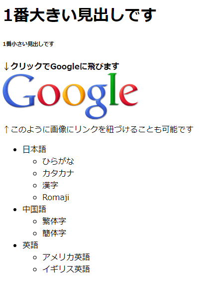

# HTM

HTMLとは？  
Hyper Text Markup Languageの略称でWebページのテキストとその構造を示した言語。  
タグ```<>```で囲んで構造を表現します。  

(例)  

```html
<h1>Hello!!</h1>
```  

<h1>Hello!!</h1>

---

```html
<h3>Hello!!</h3>
```  

<h3>Hello!!</h3>

---

```html
<h6>Hello!!</h6>
```  

<h6>Hello!!</h6>

---

```html
<a href="https://www.oit.ac.jp">OIT</a>
```  

<a href="https://www.oit.ac.jp">OIT</a>

---

```html
改<br>行
```  

改<br>行

---

```html
<strong>太字</strong>
```  

<strong>太字</strong>

---

```html
<em>斜体</em>
```  

<em>斜体</em>

---

```html
<ul>
  <li>にんじん</li>
  <li>ジャガイモ</li>
  <li>玉ねぎ</li>
</ul>
```

<ul>
  <li>にんじん</li>
  <li>ジャガイモ</li>
  <li>玉ねぎ</li>
</ul>

---

```html
<ol>
  <li>にんじん</li>
  <li>ジャガイモ</li>
  <li>玉ねぎ</li>
</ol>
```

<ol>
  <li>にんじん</li>
  <li>ジャガイモ</li>
  <li>玉ねぎ</li>
</ol>

---

```html

```  


---

```html
<table>
  <tr>
    <th>略称</th>
    <td>IS</td>
    <td>IC</td>
    <td>IM</td>
    <td>IN</td>
    <td>ID</td>
  </tr>
  <tr>
    <th>正式名称</th>
    <td>情報システム</td>
    <td>情報知能</td>
    <td>情報メディア</td>
    <td>ネットワークデザイン</td>
    <td>データサイエンス</td>
  </tr>
</table>
```

<table>
  <tr>
    <th>略称</th>
    <td>IS</td>
    <td>IC</td>
    <td>IM</td>
    <td>IN</td>
    <td>ID</td>
  </tr>
  <tr>
    <th>正式名称</th>
    <td>情報システム</td>
    <td>情報知能</td>
    <td>情報メディア</td>
    <td>ネットワークデザイン</td>
    <td>データサイエンス</td>
  </tr>
</table>

---

> ```<div></div>```  
> ```<span></span>```  
> ```<html></html>```  
> ```<head></head>```  
> ```<body></body>```  
> ```<meta></meta>```  
> ```<style></style>```  
> ```<script></script>```  
> ```<title></title>```  

---

### ハンズオン1

1. ```index.html```ファイルを作成する
2. ```index.html```ファイルの編集画面に行き、```!```を押し、そのまま```Tab```を押す。
3. テンプレートが生成されるので適宜変更する

  
このような
[Webページ](https://hitto-hub.github.io/meet-up/docs/assets/src/sample.html)
を作ってみよう！

<details><summary>答え</summary><div>

```html
<!DOCTYPE html>
<html lang="ja">

<head>
    <meta charset="UTF-8">
    <meta http-equiv="X-UA-Compatible" content="IE=edge">
    <meta name="viewport" content="width=device-width, initial-scale=1.0">
    <title>Title</title>
</head>

<body>
    <h1>1番大きい見出しです</h1>
    <h6>1番小さい見出しです</h6>
    <strong>↓クリックでGoogleに飛びます</strong>
    <br>
    <a href="https://www.google.com">
        
    </a>
    <br>
    <em>↑このように画像にリンクを紐づけることも可能です</em>

    <ul>
        <li>日本語</li>
        <ul>
            <li>ひらがな</li>
            <li>カタカナ</li>
            <li>漢字</li>
            <li>Romaji</li>
        </ul>
        <li>中国語</li>
        <ul>
            <li>繁体字</li>
            <li>簡体字</li>
        </ul>
        <li>英語</li>
        <ul>
            <li>アメリカ英語</li>
            <li>イギリス英語</li>
        </ul>
    </ul>
</body>

</html>
```

</div></details>
