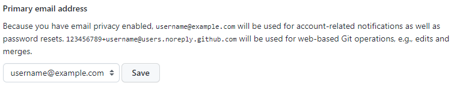

# Git GitHubを始めよう

間違ってると思ってみてね！  
~~Macの人は適時読み替えてね~~  
<details>
<summary><h2>Git GitHubって何？違いは？</h2></summary>

## Gitって何？

Gitとは、分散型バージョン管理システム(ソフト)の一つ

## Gitって何？GitHubと何が違う？

GitHubとは、Gitの代わりに、GitHubで作成したプロジェクトを公開できるサービス

## 超絶簡単に説明

GitHubとはOneDriveのプログラム向けのサービス  
GitとはGitHubとデータのやり取りをするアプリケーションの一つ  
Git、GitHubをもっと理解したいと思った君は、[こちら1](https://backlog.com/ja/git-tutorial/intro/01/)、[こちら2](https://git-scm.com/book/ja/v2)をご覧ください。
</details>

<details>
<summary><h2>GitHub,Gitを使う準備をしよう！</h2></summary>

## GitHubアカウントを作ろう

1. [GitHub](https://github.com/)のページの右上にあるSign upを押す
2. 画面に従ってメールアドレス、パスワード、ユーザーネーム等の入力をし、Create accountを押す
3. 入力したメールアドレスにメールが届くのでVerify email addressボタンをクリックし、認証する
4. 流れに沿って入力する(学生の選択肢があったら選んでください)
5. Learn to ship software like a pro.という文章が表示されたら、出来れば右のGitHubの学生得点を申請しよう！(後からでも申請できるので、めんどくさかったら左の無料で続けるを押しましょう)


## Gitをダウンロードインストールしよう

> Macの人は[これ](https://prog-8.com/docs/git-env)の1~3でもみてがんばって！

1. windowsでは、[Git公式サイト](https://git-scm.com/download/win)に行き、**Standalone Installerの64-bit Git for Windows Setup**をクリックしてダウンロードする
2. さっきダウンロードしたものを起動して、全て雰囲気でNextを押してインストールする
3. インストール完了後、Windowsキーを押し、新しくインストールされたGit bashを起動してPCの名前とメアドを設定する

""(ダブルクオーテーション)の中には、適当な文字列を入れてください。

名前(なんでもいいよ)

```bash
git config --global user.name "名前を入力"
```

[このページ](https://github.com/settings/emails)のPrimary email addressの下の文章内にある
**数字＋ユーザーネーム@users.noreply.github.com**のメールアドレスを登録する

```bash
git config --global user.email "数字＋ユーザーネーム@users.noreply.github.com"
```

**この2つの情報は外部にも公開されるので取り扱いには注意しましょう**


## GitHubにSSHの設定をする

> Macの人は[これ](https://prog-8.com/docs/git-env)の5でもみてがんばって！

1. 公開鍵・秘密鍵を作成する
左下の虫眼鏡でPowerShellと検索してPowerShellを起動してください
"C:\Users\＜ユーザー名＞"に.sshフォルダを作成する

```bash
mkdir -p ~/.ssh
```

"C:\Users\＜ユーザー名＞\.ssh"に移動

```bash
cd ~/.ssh
```

2. 公開鍵を作成する
"C:\Users\＜ユーザー名＞\.ssh"内に"id_rsa.pub","id_rsa"を作成する  
何か聞かれたら適当にエンターを押せば問題ないです

```bash
ssh-keygen -t rsa
```

↓こんなんがでる

```bash
ssh-keygen -t rsa
Generating public/private rsa key pair.
Enter file in which to save the key (/Users/(username)/.ssh/id_rsa):
Enter passphrase (empty for no passphrase):
Enter same passphrase again:
```

下のコマンドを打ってちゃんと作られているか確認してください

```bash
cat id_rsa.pub
```

3. 公開鍵をGitHubにアップする
[このページ](https://github.com/settings/ssh)に移動して、Public keyを追加する。  

- New SSH keyを押す  
- Titleは適当に入力する  
- Keyの中に"cat id_rsa.pub"を打った時に出てきたとっても長い文字列を入力(コピペ)する。  
- Add SSH keyを押す  
- SSH 接続を確認する  
↓を入力して実行して"yes/no"と出てきたらyesと入力してEnterキーを押してください。  

```bash
ssh -T git@github.com
```

無理だったら、、、
| ssh -T git@github.com -i "ここにファイルのパス"

successと出てきたら、okです。おめでとう！
</details>

<details>
<summary><h2>GitHub,Gitを使おう</h2></summary>

[こっちに書いてます](git.md)

</details>

参考にした記事
---

[Macのやつ](https://prog-8.com/docs/git-env)  
[もっと理解したい人へのやつ](https://backlog.com/ja/git-tutorial/intro/01/)  
[もっと理解したい人へのやつ2](https://git-scm.com/book/ja/v2)  
