# start-VScode

## Visual Studio Codeをダウンロードしよう

[ここ](https://code.visualstudio.com/download)で自分のパソコンのVisual Studio Codeをダウンロードしてインストールしましょう。  

## Visual Studio Codeを使ってみよう

その前にVisual Studio Codeを日本語に設定しておきましょう。  
How to?  
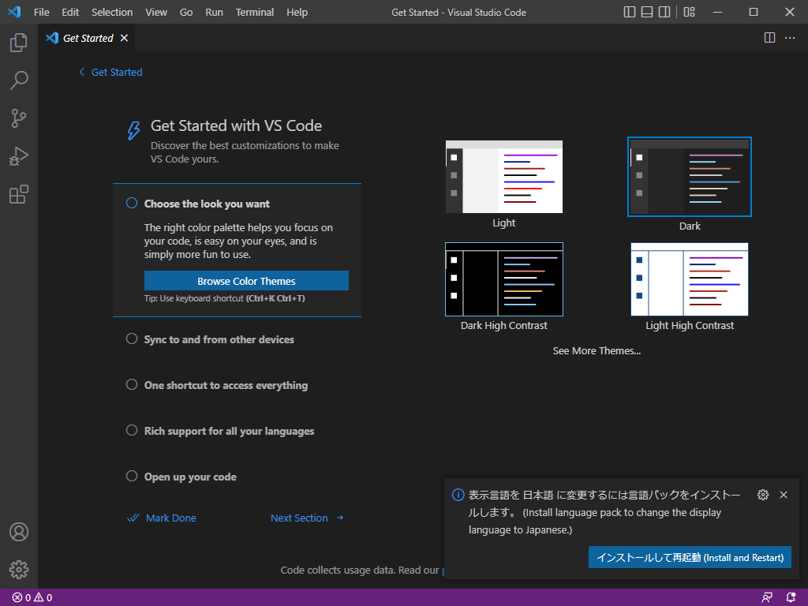  
右下のポップアップが表示されたら青色のボタンを押しましょう。
もしも上のメッセージが表示されなかったら下にある"Visual Studio Codeの拡張機能をインストールしよう"を見ましょう。  

### Visual Studio Codeでファイルを開こう

ctrl + shift + n で新規windowを開きます。  
フォルダーを開くをクリック、もしくは開きたいファイルをドラッグ&ドロップします。(ファイルを開くがないときはctrl + shift + Eを押して開きます)。  
適当に選んでおきましょう。  
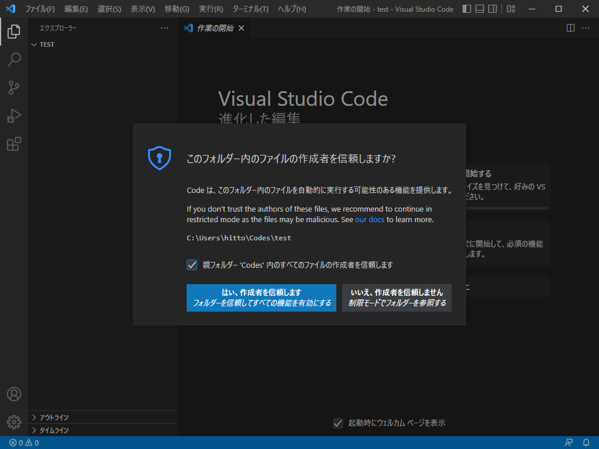  

### Visual Studio Codeで新しいファイルをGithubにアップロード(Create a new repository)する

Visual Studio CodeでGithubにアップロードするには、以下のようにします。  
> GitHubへのログインを求められたら、適当にログインしておきましょう。

1. アップロードしたいファイルを開きます。  
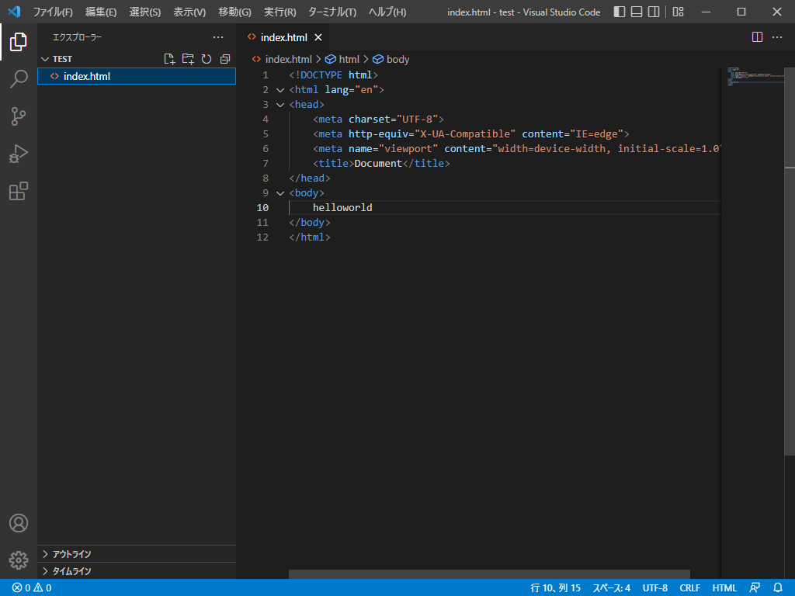  
2. 左にあるソース管理をクリックして"Githubに公開"をクリックします。
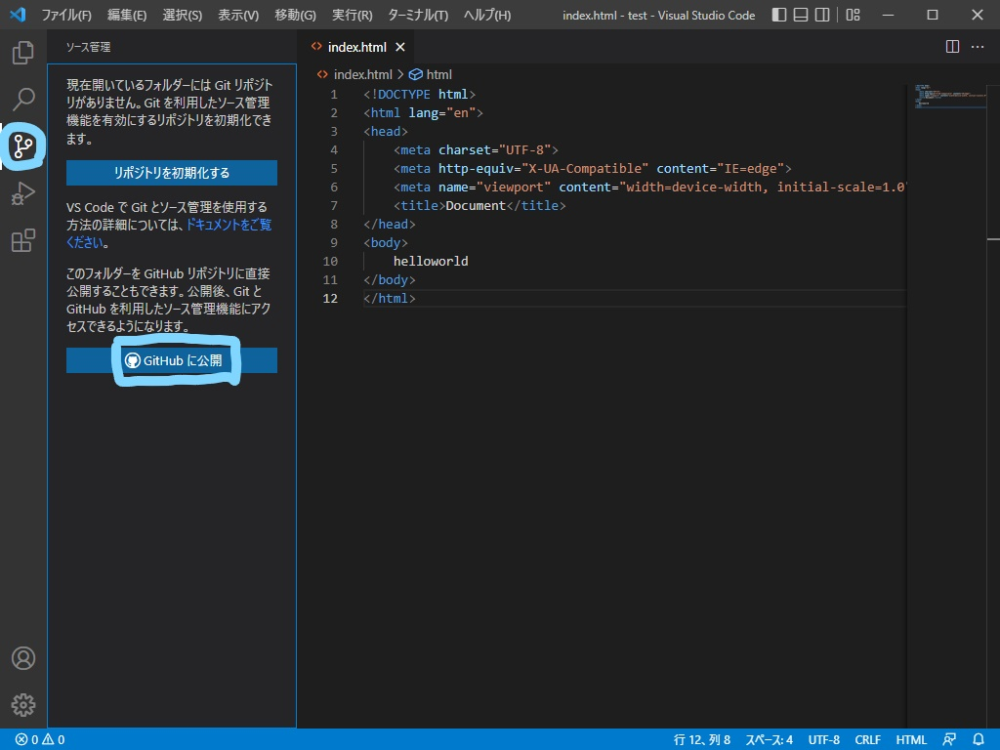  
3. リポジトリ名、private/publicを選びます。
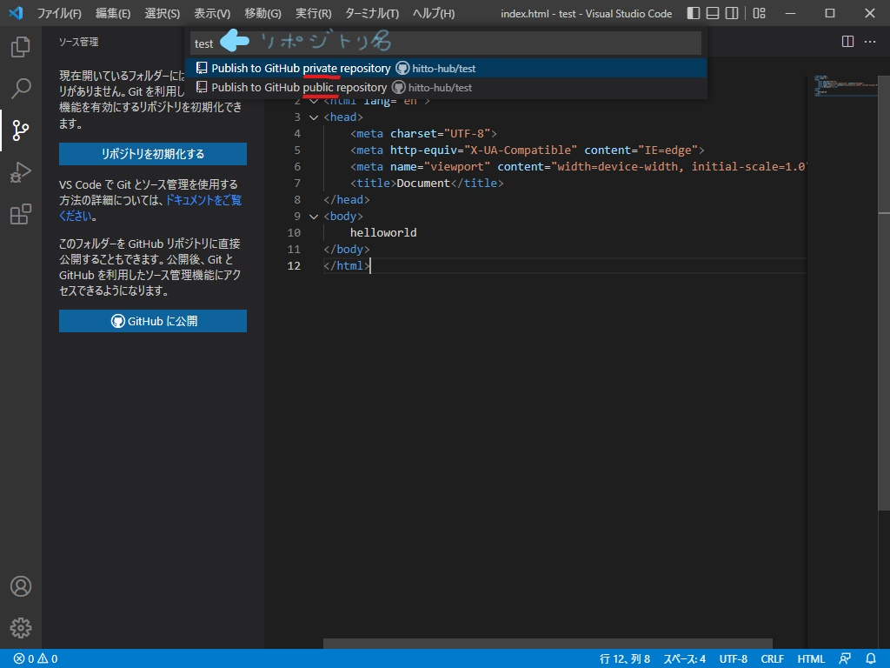  
4. アップデートするファイルを選びます(基本的に全ファイルにチェックしましょう)。OKをおすとアップロードが開始されます。  
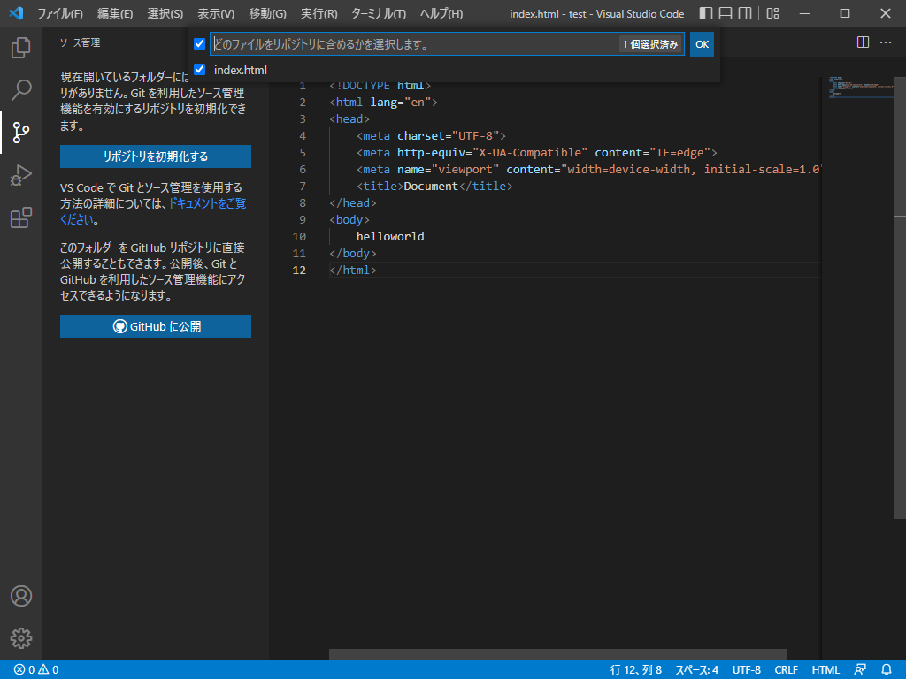  
5. 右下のポップアップメッセージが表示されたらアップロード完了です。  
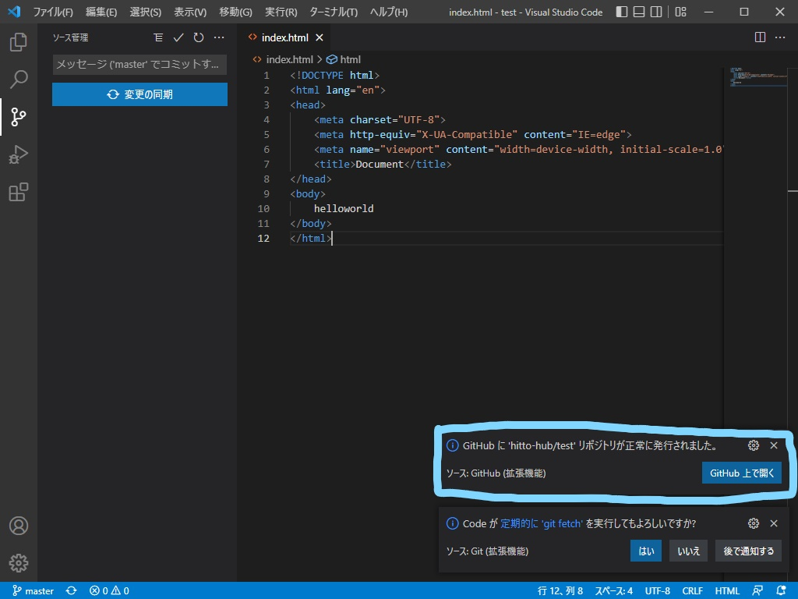  
6. 見事にアップロードが完了しました。  
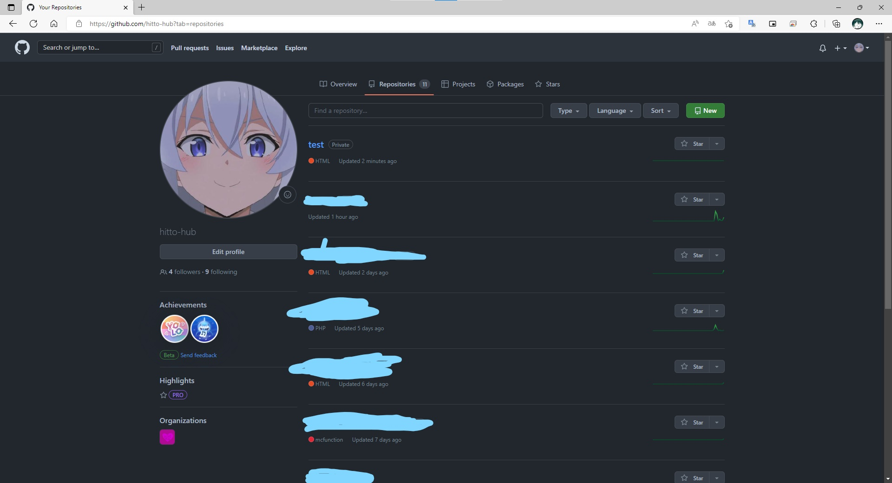  

### Visual Studio CodeでGithubからダウンロード(clone)する

Visual Studio CodeでGithubからダウンロードするには、以下のようにします。  
> GitHubへのログインを求められたら、適当にログインしておきましょう。

1. 画像で囲っている部分をクリックします。
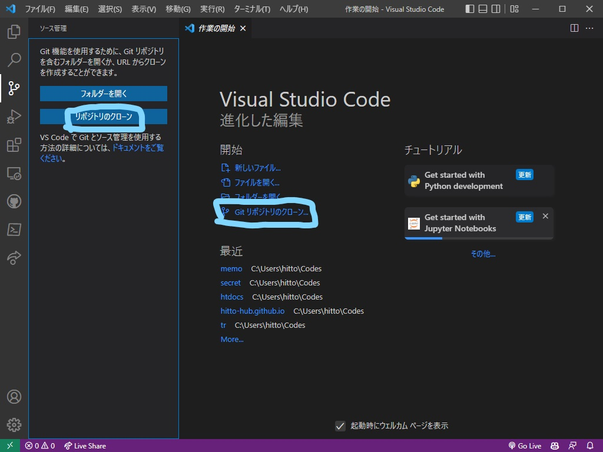  
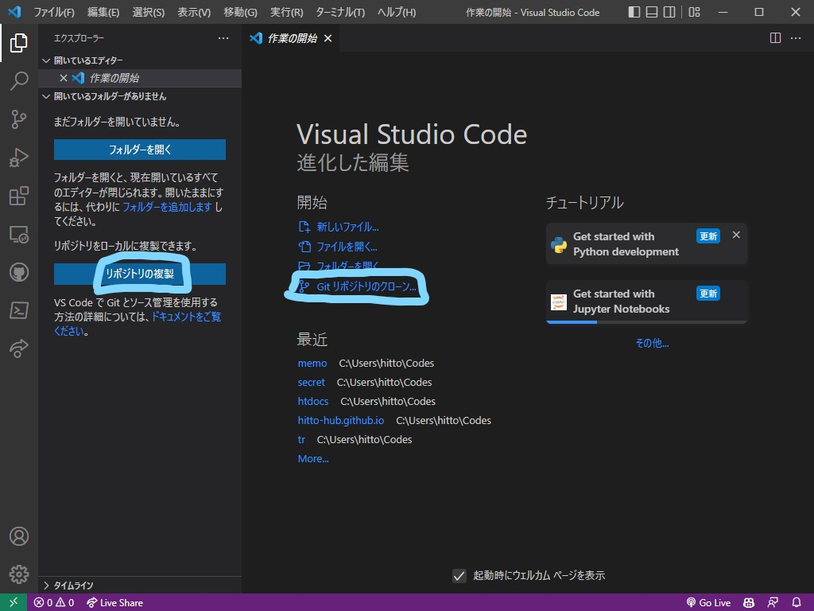  
2. githubから複製をクリックします。
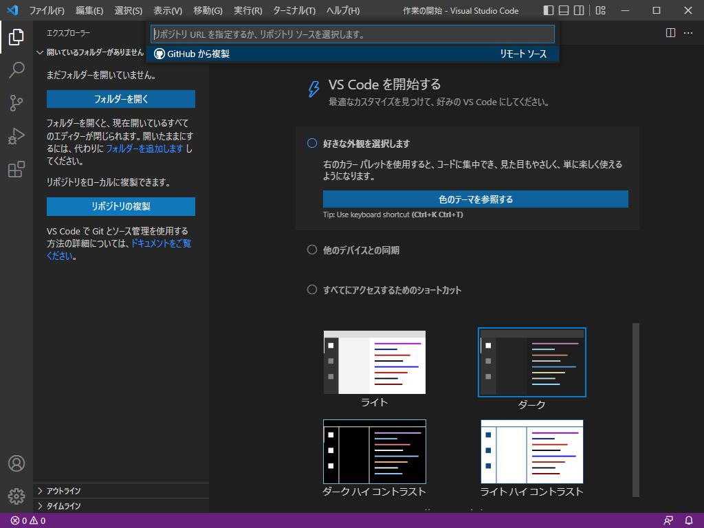  
3. ダウンロードしたいリポジトリを選びます。
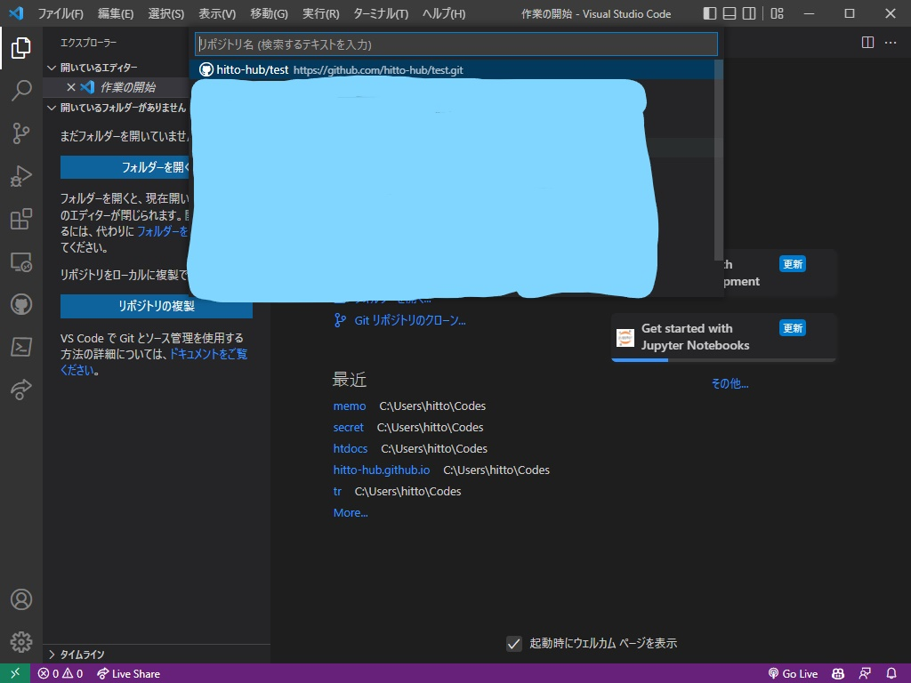
4. ダウンロードする場所を選びます。(好みの場所でおっけーです)

## Visual Studio Codeの拡張機能をインストールしよう

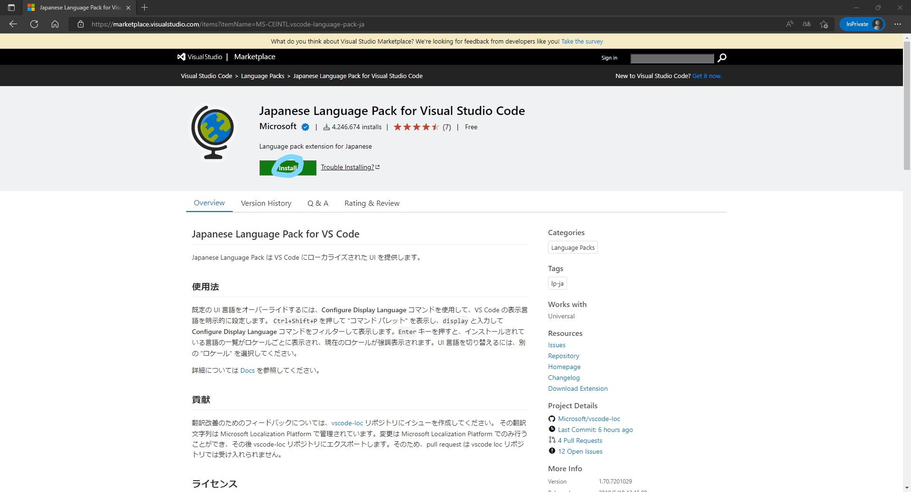  
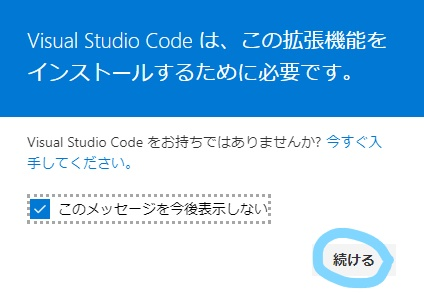  
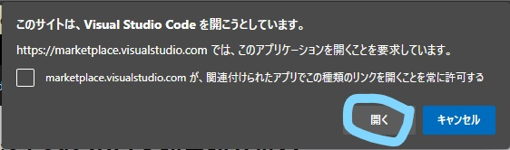  
VScodeが開くのでインストールをおして再起動を求められたらしましょう  

## Visual Studio Codeのおすすめ拡張機能

[Github Copilot](https://marketplace.visualstudio.com/items?itemName=GitHub.copilot)  
AIがコメントや前のコードからコードを推論して補完してくれる。初めて触ったときは感動で手が震えた。学生なら無料なので学生なら入れよう  
[Git Graph](https://marketplace.visualstudio.com/items?itemName=mhutchie.git-graph)いい感じに表示される。
[vscode-icons](https://marketplace.visualstudio.com/items?itemName=vscode-icons-team.vscode-icons)  
アイコンがわかりやすくなる。  
[markdownlist](https://marketplace.visualstudio.com/items?itemName=DavidAnson.vscode-markdownlint)  
Markdownで厳しめに間違いを指摘してくれる。僕が入れたら9割り黄色くなりました。  
[Markdown Preview Enhanced](https://marketplace.visualstudio.com/items?itemName=shd101wyy.markdown-preview-enhanced)  
Markdown(.md)でctrl + k , vを押すとプレビューを表示してくれる。チョー便利  
[IntelliSense for CSS class names in HTML](https://marketplace.visualstudio.com/items?itemName=Zignd.html-css-class-completion)  
CSSのクラス名を補完できる。  
[Auto Rename Tag](https://marketplace.visualstudio.com/items?itemName=formulahendry.auto-rename-tag)  
HTMLのタグの開始と終了タグを同時に編集できる  
[Live Server](https://marketplace.visualstudio.com/items?itemName=ritwickdey.LiveServer)  
クリックで簡易サーバーを立ててくれる。  
[Live Share](https://marketplace.visualstudio.com/items?itemName=MS-vsliveshare.vsliveshare)  
同じ環境で同じコードを共有できる  
[C/C++](https://marketplace.visualstudio.com/items?itemName=ms-vscode.cpptools)  
C言語書くなら必須  
[Python](https://marketplace.visualstudio.com/items?itemName=ms-python.python)  
Python書くなら必須  

 >もっといい拡張機能があれば教えてほしい
